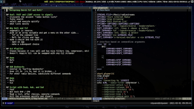
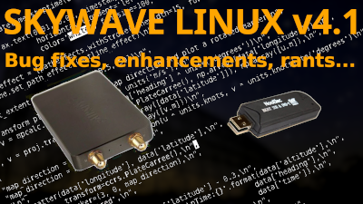

### Welcome to the Git World of Philip Collier 👋

Here is where I keep the core of my large and small computing projects.

- :angry: If you haven't already, expedite your ass out for your vaccinations.  Wear a fookin' mask.  Stay alive and don't infect _me_.
- 🔭 I’m currently working on [Skywave Linux], [Catbird Linux], and [MOFO Linux], plus creating content for [AB9IL.net] and [Mach 7 Radio Intercepts].
- 👯 I am writing handbooks on [SDRs for airband], [study and test taking skills], and other topics.
- 🌱 I’m currently learning how to apply Python, Go, and Bash programming in software defined radio and data science.
- 💬 Ask me about radio; been a licensed ham since 1978 [callsigns KA3BVX, KG2DH, AB9IL] and commercially licensed since the early 2000s.
- 💬 Ask me about aviation; been a licensed pilot since 1985.  Type rated and experienced Boeing 767, 757, and 737 captain.  By the way, the airline industry is in terrible condition - a rust belt industry dressed in shiny aluminum and glass.  Run like hell if you can.
- 📫 How to reach me: Right here on Github.
- :shit: Did you know that 1 out of 3 [pro Trump seditionists] is as dumb as the other 2?
- ⚡ Fun fact: Some people relax with music, others enjoy art.  A few abuse substances.  I collect pictures of pigeons.  If I'm ever having a bad day, I think of the pigeons and how there's a place in the world for even those little, but magnificent, creatures.  If they have a place, then so do I (and so do you).  Matthew chapter 6.

Video - Setting up a Rofi / fzf radio streamer:

Video - Skywave Linux 4.1 features, bugfixes, rants:

 
 

[AB9IL.net]: https://www.ab9il.net
[study and test taking skills]: https://amzn.to/3ExUfkK
[Mach 7 Radio Intercepts]: https://youtube.com/user/AB9IL
[SDRs for airband]: https://amzn.to/3w8y95j
[Skywave Linux]: https://skywavelinux.com
[Catbird Linux]: https://catbirdlinux.com
[MOFO Linux]: https://mofolinux.com
[pro Trump seditionists]: https://youtu.be/sDF-UIr-waI
