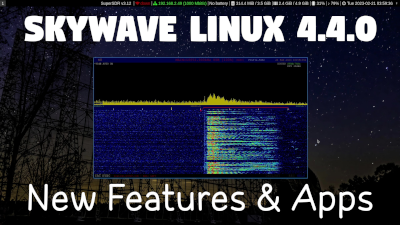

### Welcome to the Git World of Philip Collier 👋

Here is where I keep the core of my large and small computing projects.

- 🔭 I’m currently working on [Skywave Linux], a bootable live Linux environment for global and borderless access to over the air broadcast media.
- 🔭 I’m currently working on [Catbird Linux], a bootable live Linux environment for content creation, web scraping, data analysis, writing, and note taking.
- 🔭 I’m currently working on [MOFO Linux], a bootable live Linux environment for global and borderless access to multimedia, forums, and cypher spaces.
- 🔭 I’m currently creating written content for [AB9IL.net] and videos for [Mach 7 Radio Intercepts].
- 👯 I am writing about [KiwiSDR for online shortwave radio], [RTL-SDRs for airband radio], plus [defeating censorship and information warfare].
- 🌱 I’m currently learning how to apply Python, Go, and Bash programming in software defined radio and data science.
- 💬 Ask me about radio; been a licensed ham since 1978 [callsigns KA3BVX, KG2DH, AB9IL] and commercially licensed since the early 2000s.
- 💬 Ask me about aviation; been a licensed pilot since 1985.  Type rated and experienced Boeing 767, 757, and 737 captain.  By the way, the airline industry is in terrible condition - a rust belt industry dressed in shiny aluminum and glass.  Run like hell if you can.
- 📫 How to reach me: Right here on Github.
- ⚡ Fun fact: Some people relax with music, others enjoy art.  A few abuse substances.  I collect pictures of pigeons.  If I'm ever having a bad day, I go for a stroll in the nearest park, feed a few pigeons and reflect on how there's a place in the world for even those magnificent little creatures.  If they have a place, then so do I (and so do you).  Matthew chapter 6.

Video - Skywave Linux 5 - Rolling Debian Sid - Linux for SWLs and Hams:

Video - Skywave Linux 4.4 - i3 and SDRs Galore:

 
 

[AB9IL.net]: https://www.ab9il.net
[defeating censorship and information warfare]: catbirdlinux.com/book08/
[Mach 7 Radio Intercepts]: https://youtube.com/user/AB9IL
[KiwiSDR for online shortwave radio]: skywavelinux.com/book07/
[RTL-SDRs for airband radio]: skywavelinux.com/book02/
[Skywave Linux]: https://skywavelinux.com
[Catbird Linux]: https://catbirdlinux.com
[MOFO Linux]: https://mofolinux.com
[Trumpist seditionists]: https://odysee.com/@Mach7RadioIntercepts:1/january-6-a-coup-unpunished-is-called:2
